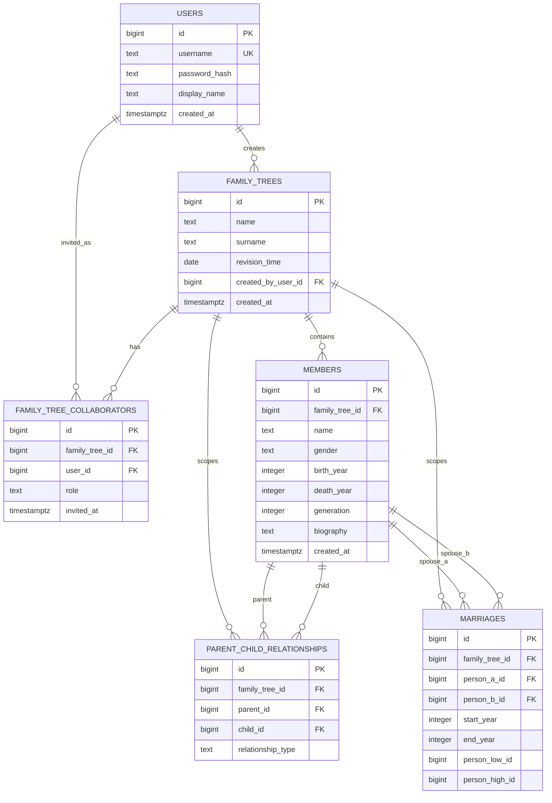

# RootTrace 数据库设计

本文档说明 RootTrace 族谱管理系统的概念结构设计和逻辑结构设计。目标 RDBMS 为 PostgreSQL。

Milestone 3 只覆盖数据库设计与 DDL 验证，不实现注册、登录、应用服务、SQLAlchemy models、migrations 或业务路由。

## 实体设计

### users

用于存储注册用户。

属性：
- `id`：主键。
- `username`：登录用户名，唯一。
- `password_hash`：密码哈希值，用于后续认证功能。
- `display_name`：用户展示名称。
- `created_at`：创建时间。

### family_trees

用于存储族谱。每个族谱对应一个家族。

属性：
- `id`：主键。
- `name`：谱名。
- `surname`：姓氏。
- `revision_time`：修谱时间。
- `created_by_user_id`：创建用户。
- `created_at`：创建时间。

### family_tree_collaborators

用于存储受邀参与某个族谱编辑的用户。

属性：
- `id`：主键。
- `family_tree_id`：对应族谱。
- `user_id`：受邀用户。
- `role`：协作者角色。
- `invited_at`：邀请时间。

### members

用于存储某个族谱中的家族成员。

属性：
- `id`：主键。
- `family_tree_id`：所属族谱。
- `name`：成员姓名。
- `gender`：性别，取值为 `male`、`female` 或 `unknown`。
- `birth_year`：出生年份。
- `death_year`：死亡年份。
- `generation`：族谱中的辈分编号。
- `biography`：生平简介。
- `created_at`：创建时间。

姓名不设置唯一约束，因为实验要求中明确存在同名同姓但不同辈分的情况。系统始终使用 `id` 区分不同成员。

### parent_child_relationships

用于存储两个成员之间的亲子血缘关系。

属性：
- `id`：主键。
- `family_tree_id`：所属族谱。
- `parent_id`：父/母成员。
- `child_id`：子女成员。
- `relationship_type`：关系类型，取值为 `father` 或 `mother`。

### marriages

用于存储两个成员之间的婚姻关系。

属性：
- `id`：主键。
- `family_tree_id`：所属族谱。
- `person_a_id`：配偶一方。
- `person_b_id`：配偶另一方。
- `start_year`：婚姻开始年份。
- `end_year`：婚姻结束年份。

## 联系设计

- 一个 `users` 记录可以创建多个 `family_trees` 记录，二者为 1:N 联系。
- 一个 `family_trees` 记录可以包含多个 `members` 记录，二者为 1:N 联系。
- `users` 与 `family_trees` 之间存在协作编辑关系，通过 `family_tree_collaborators` 转换为 M:N 联系。
- `members` 与自身存在递归亲子联系，通过 `parent_child_relationships` 转换为递归 M:N 联系。
- `members` 与自身存在递归婚姻联系，通过 `marriages` 转换为递归 M:N 联系。

## ER Diagram

Mermaid 源文件也保存在 `docs/er.mmd`。下面的 fenced block 用于让 Typora 等 Markdown 工具直接渲染 ER 图。



## ER 到关系模式转换

| ER 元素 | 联系类型 | 转换后的关系表 | 转换规则 |
| --- | --- | --- | --- |
| 用户实体 | 实体 | `users` | 每个注册用户对应一条记录。 |
| 族谱实体 | 实体 | `family_trees` | 每个族谱对应一条记录，`created_by_user_id` 记录创建者。 |
| 成员实体 | 实体 | `members` | 每个家族成员对应一条记录，允许重名，通过 `id` 区分。 |
| 用户创建族谱 | 1:N | `family_trees.created_by_user_id` | 在 N 端 `family_trees` 中保存 1 端 `users` 的主键作为外键。 |
| 族谱包含成员 | 1:N | `members.family_tree_id` | 在 N 端 `members` 中保存 1 端 `family_trees` 的主键作为外键。 |
| 用户协作编辑族谱 | M:N | `family_tree_collaborators` | 将多对多联系转换为中间关系表。 |
| 成员是另一成员的父/母 | 递归 M:N | `parent_child_relationships` | 将递归联系转换为关系表，使用 `parent_id` 和 `child_id` 指向 `members`。 |
| 成员与另一成员结婚 | 递归 M:N | `marriages` | 将递归联系转换为关系表，使用两个成员外键表示婚姻双方。 |

## 关系模式

```text
users(id PK, username UNIQUE, password_hash, display_name, created_at)

family_trees(
  id PK,
  name,
  surname,
  revision_time,
  created_by_user_id FK -> users.id,
  created_at
)

family_tree_collaborators(
  id PK,
  family_tree_id FK -> family_trees.id,
  user_id FK -> users.id,
  role,
  invited_at,
  UNIQUE(family_tree_id, user_id)
)

members(
  id PK,
  family_tree_id FK -> family_trees.id,
  name,
  gender,
  birth_year,
  death_year,
  generation,
  biography,
  created_at
)

parent_child_relationships(
  id PK,
  family_tree_id FK -> family_trees.id,
  parent_id FK -> members.id,
  child_id FK -> members.id,
  relationship_type,
  UNIQUE(parent_id, child_id, relationship_type)
)

marriages(
  id PK,
  family_tree_id FK -> family_trees.id,
  person_a_id FK -> members.id,
  person_b_id FK -> members.id,
  start_year,
  end_year,
  person_low_id,
  person_high_id,
  UNIQUE(person_low_id, person_high_id)
)
```

## 约束说明

- 每张表都定义主键。
- 外键用于维护用户、族谱、成员、亲子关系、婚姻关系之间的引用完整性。
- `users.username` 设置唯一约束，避免重复用户名。
- `family_tree_collaborators` 使用 `(family_tree_id, user_id)` 唯一约束，避免同一用户在同一族谱中重复协作记录。
- `members.gender` 使用 CHECK 约束限制为 `male`、`female`、`unknown`。
- `members.death_year` 在出生年份和死亡年份都存在时，必须大于或等于 `birth_year`。
- `parent_child_relationships.relationship_type` 使用 CHECK 约束限制为 `father` 或 `mother`。
- `parent_child_relationships` 防止成员成为自己的父/母。
- `marriages` 防止成员与自己结婚，并通过生成的有序成员 ID 避免 A-B 与 B-A 重复记录。

PostgreSQL 的 `CHECK` 约束不能直接比较其他表中的值。因此，“父母出生年份必须早于子女出生年份”这类跨表规则，需要在后续 milestone 中通过 trigger 或应用层校验实现。

## 约束设计

| 表 | 主键 | 外键 | UNIQUE 约束 | CHECK 约束 |
| --- | --- | --- | --- | --- |
| `users` | `id` | 无 | `username` | 无 |
| `family_trees` | `id` | `created_by_user_id -> users(id)` | 无 | 无 |
| `family_tree_collaborators` | `id` | `family_tree_id -> family_trees(id)`, `user_id -> users(id)` | `(family_tree_id, user_id)` | `role IN ('editor')` |
| `members` | `id` | `family_tree_id -> family_trees(id)` | 无 | `gender IN ('male', 'female', 'unknown')`, `death_year >= birth_year`, `generation > 0` |
| `parent_child_relationships` | `id` | `family_tree_id -> family_trees(id)`, `parent_id -> members(id)`, `child_id -> members(id)` | `(parent_id, child_id, relationship_type)` | `relationship_type IN ('father', 'mother')`, `parent_id <> child_id` |
| `marriages` | `id` | `family_tree_id -> family_trees(id)`, `person_a_id -> members(id)`, `person_b_id -> members(id)` | `(person_low_id, person_high_id)` | `person_a_id <> person_b_id`, `end_year >= start_year` |

这些约束的 DDL 实现在 `sql/schema.sql` 中。

## 规范化分析

本设计目标满足 3NF。

- 每张表只表示一种实体或一种联系。
- 非主属性依赖于本表主键，不依赖于其他非主属性。
- 多对多联系被拆分到独立关系表中，避免重复字段组。
- 用户信息不在族谱表或协作者表中重复存储。
- 族谱信息不在成员表中重复存储。
- 成员姓名等基本信息存储在 `members` 中，关系表只保存成员 ID。
- 避免传递依赖。例如协作者角色属于“用户-族谱”协作关系，而不是单独属于 `users` 或 `family_trees`。

当前设计也基本满足 BCNF，因为决定因素主要通过主键或唯一约束表达。后续如果加入更多业务规则，应在实现后重新检查是否引入新的函数依赖。

## 后续 milestone 说明

- 用户注册和登录属于 Milestone 4。
- SQLAlchemy models 和 migrations 不属于 Milestone 3。
- 查询 SQL、索引设计、导入导出、性能实验属于后续 milestone。
